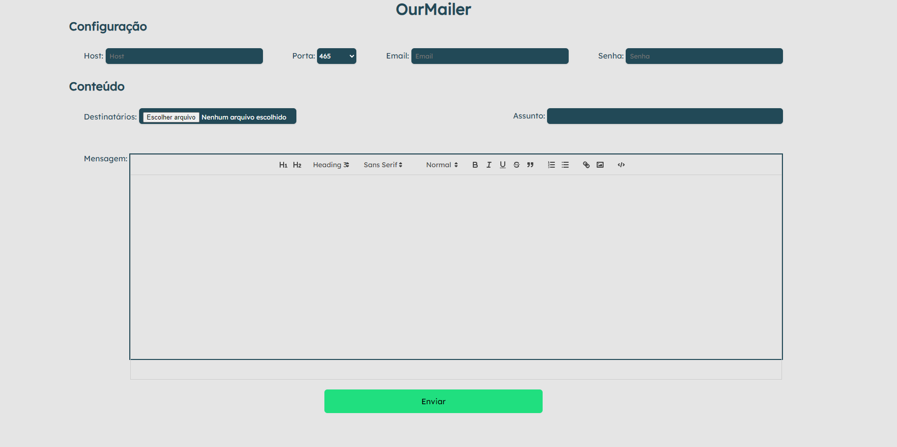

# OurMailer

Esse projeto é um disparador de emails automáticos por meio de uma lista de destinatários (CSV), utilizando **TypeScript, NodeJS, Express, Nodemailer e ReactJs**.

Este disparador funciona somente com emails SMTP, e é preciso definir as configurações do seu host.

## Como executar

1. Clone o repositório
2. Entre na pasta backend e frontend
3. Instale os pacotes utilizando o comando `npm install`
4. Rode o projeto com o comando `npm run dev`

## Como usar

Para poder disparar emails é preciso setar algumas informações de configuração do seu email e servidor smtp.

  - Host: O hostname do servidor smtp, como por exemplo (**smtp.gmail.com**).
  - Porta: A porta de conexão do servidor, por padrão a porta é **587** caso não é usado TLS para a conexão com o servidor e **465** caso for usado.
  - Email: Email que vai ser usado para disparar os emails.
  - Senha: Senha do email.

E também, setar as informações de contéudo do email como por exemplo o destinatário, o assunto e conteúdo da mensagem.
  - Destinatários: Deve ser inserido um arquivo `.csv` com os emails dos seus destinatários.
  - Assunto: O assunto do seu email.
  - Mensagem: A mensagem do seu email podendo anexar imagem.
  

